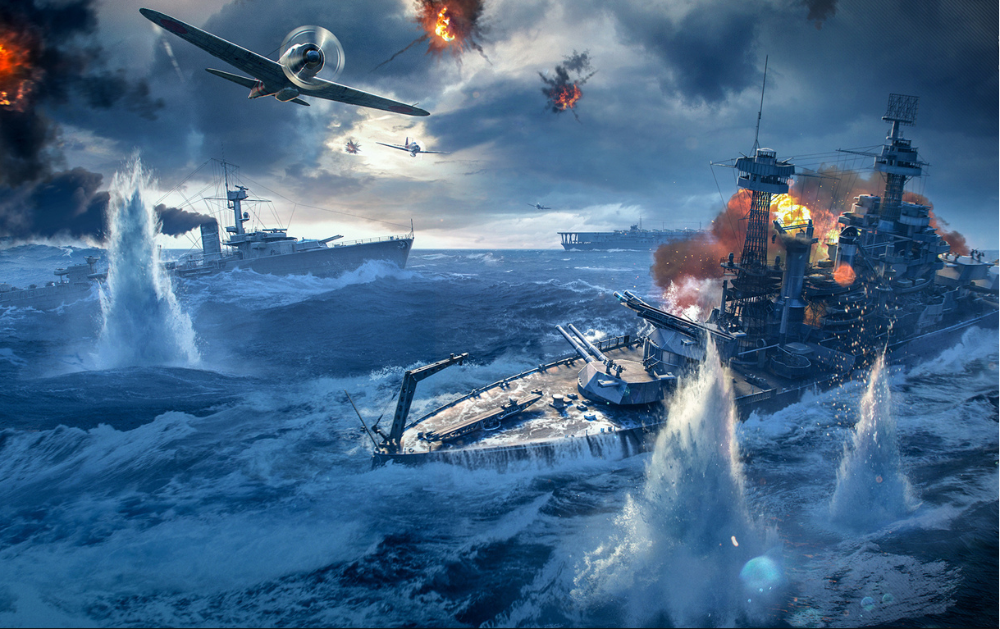

# Морской Бой

	«Морской бой» — игра для двух участников, в которой игроки по очереди называют координаты на неизвестной им карте соперника. Если у соперника по этим координатам имеется корабль (координаты заняты), то корабль или его часть «топится», а попавший получает право сделать ещё один ход. Цель игрока — первым потопить все корабли противника.

	Игрок в начале игры может выбрать автоматическую расстановку кораблей на своём поле, либо при помощи мыши расставить корабли вручную. Поворот корабля производится на прокрутки колёсика мыши.
	
	Далее игрок может выбрать соперника 3 уровней сложности:
	1. Лёгкий соперник, это компьютер, который не будет знать где расположен флот игрока.
	2. Средний соперник, это компьютер, который точно знает о 20 клетках игрока, где точно нет кораблей (туда он стрелять не будет)
	3. Сложный соперник, это компьютер, который точно знает о 40 клетках игрока, где точно нет кораблей (туда он стрелять не будет)

	Компьютер будет обстреливать совершенно в случайном порядке поле, где расположенны корабли игрока.

	Игра закончится когда игрок убьёт все корабли компьютера, либо когда компьютер убьёт все корабли игрока. Далее будет сообщён победитель и будет предложенно начать новую игру.
	
	Управление полностью на мыши.
	
	Используемые технологии HTML5, CSS, JS.

	Структура проекта: в папке с игрой index.html является файлом запуска игры.  В папке src находятся: находятса файлы с расширением .js, которые выполняют свою логическую роль в игре (роль соответствует их названиям), а так же есть папка scenes, где хранятся две сцены - ComputerScene.js - Это сцена битвы с компьютерным соперником, а PreparationScene.js - сцена подготовеи к битве (расстоновка кораблей и выбор соперника). Все стили хранятся в style.css для игры. 

